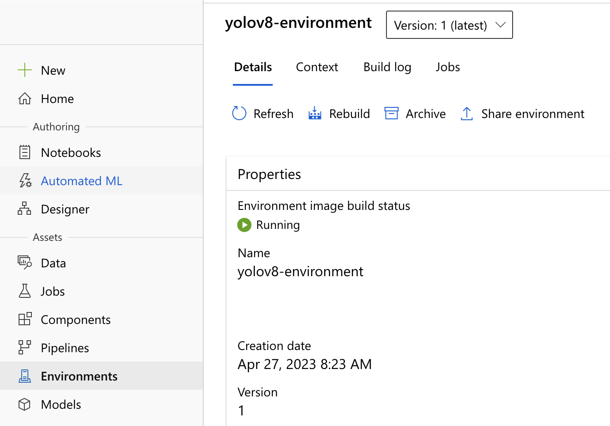
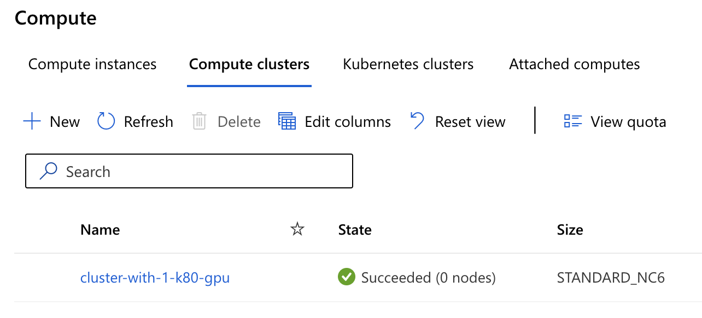
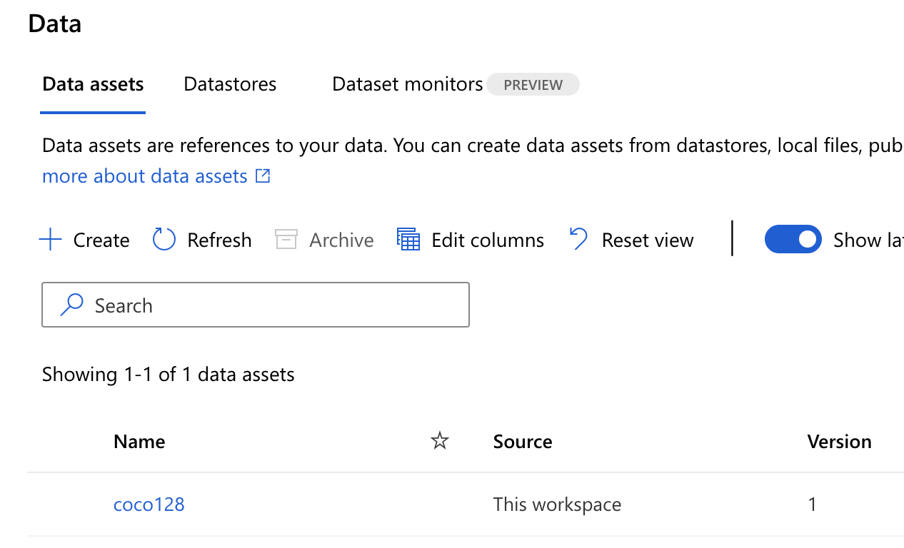
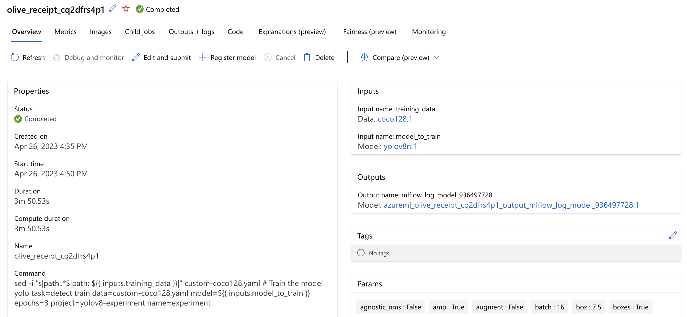
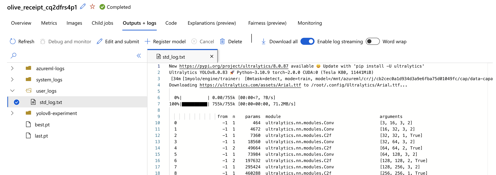
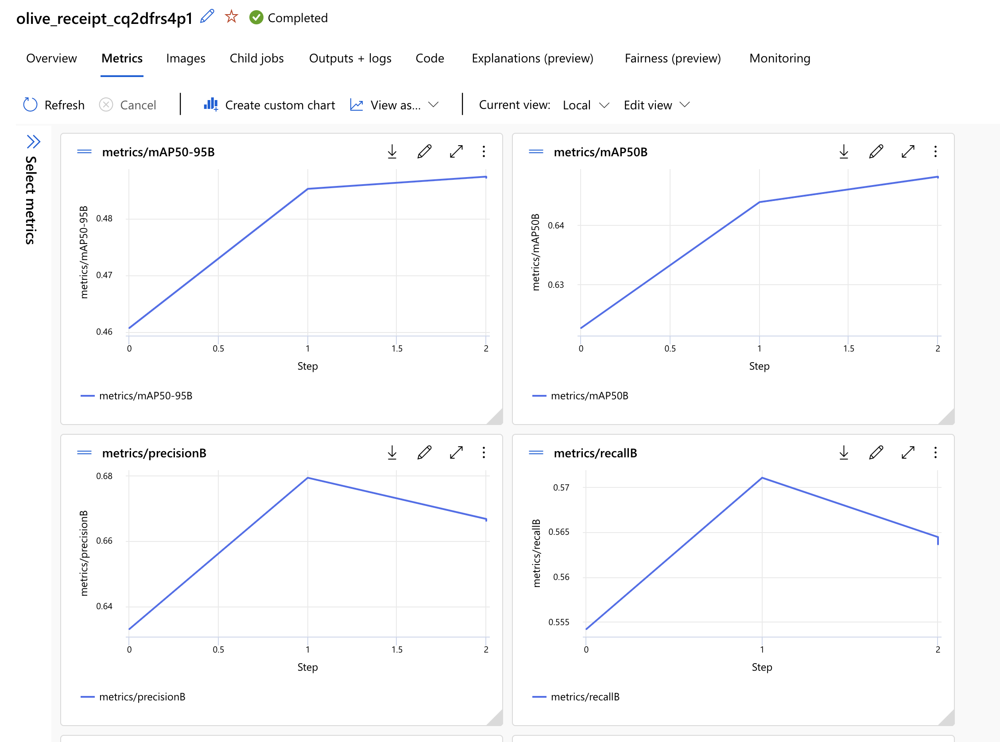
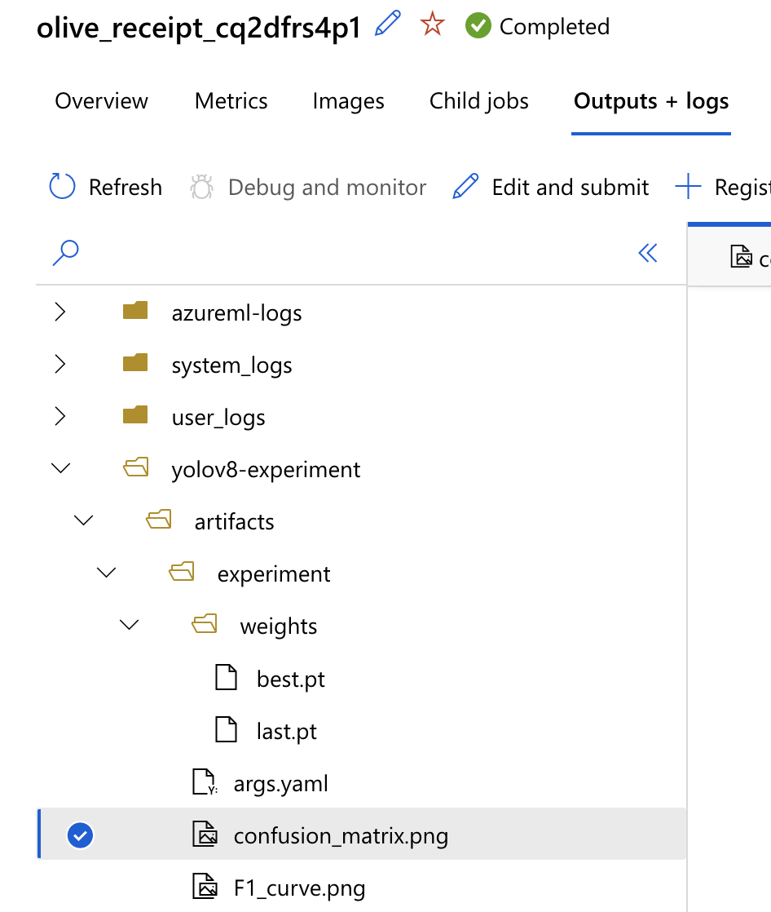
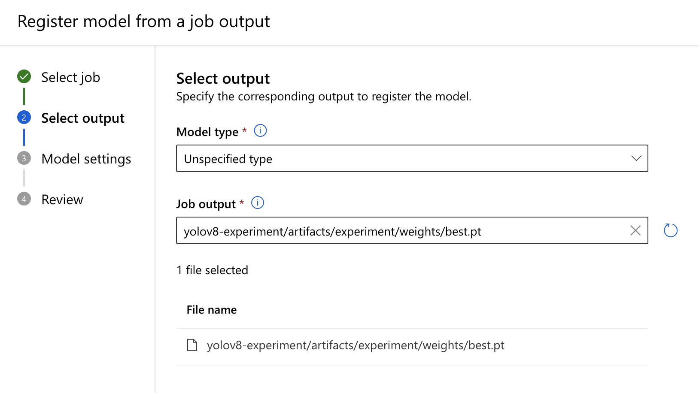
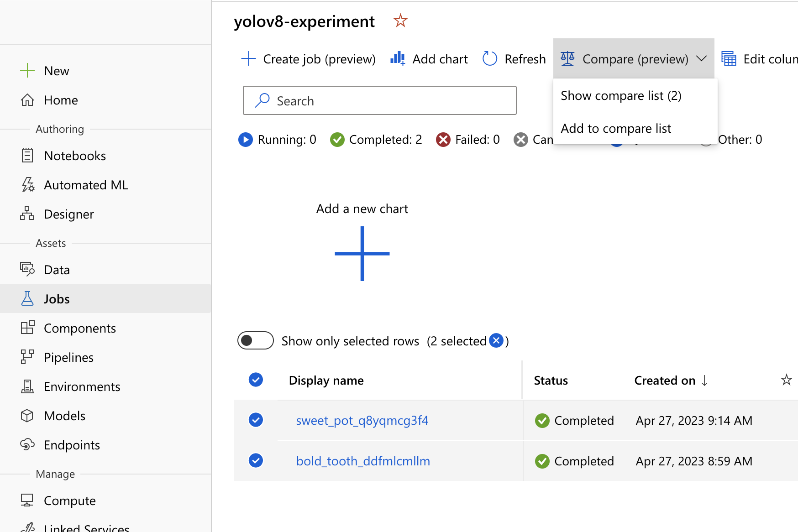
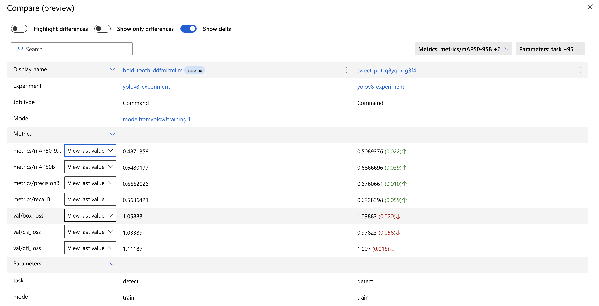

# How to train the yolov8 model with AzureML - az CLI

Azure Machine Learning provides a comprehensive solution for managing the entire lifecycle of machine learning models. In this tutorial, we'll explore how to use AzureML to train and continuously improve an open source model. Here we will train the [Yolov8 model](https://github.com/ultralytics/ultralytics) object detection model developed by Ultralytics.

## Prerequisites

- An [AzureML workspace](https://learn.microsoft.com/azure/machine-learning/quickstart-create-resources).
- Install the [Azure CLI](https://learn.microsoft.com/en-us/cli/azure/install-azure-cli).
- Install the [az cli AzureML extension](https://learn.microsoft.com/azure/machine-learning/how-to-configure-cli).
- Sign in using [az login](https://learn.microsoft.com/en-us/cli/azure/authenticate-azure-cli)

## Configure your workspace and resource group

Let's configure your default workspace and resource group. It will avoid specifying your AzureML workspace and resource group for every AzureML command. If you don't configure it you will need to append the `-w <your-azureml-workspace> -g <your-resource-group>` options to all your `az ml` commands.

```bash
az configure --defaults workspace=<your-workspace-name> group=<your-resource-group-name>
```

## Create an azureml folder

Let's create an azureml folder where we will store all our azureml resource definitions.

```bash
mkdir azureml
```

## Create an AzureML environment

We need to create an [AzureML environment](https://learn.microsoft.com/azure/machine-learning/how-to-manage-environments-v2) with all the required dependencies to run our training.

Let's create a folder `azureml-environment`, it will contain the docker-context to build the environment. In this folder, let's add a Dockerfile with the required dependencies to run our training:

```Dockerfile
FROM pytorch/pytorch:2.0.0-cuda11.7-cudnn8-runtime

# Downloads to user config dir
ADD https://ultralytics.com/assets/Arial.ttf https://ultralytics.com/assets/Arial.Unicode.ttf /root/.config/Ultralytics/

# Install linux packages
ENV DEBIAN_FRONTEND noninteractive
RUN apt update
RUN TZ=Etc/UTC apt install -y tzdata
RUN apt install --no-install-recommends -y gcc git zip curl htop libgl1-mesa-glx libglib2.0-0 libpython3-dev gnupg g++

# Security updates
# https://security.snyk.io/vuln/SNYK-UBUNTU1804-OPENSSL-3314796
RUN apt upgrade --no-install-recommends -y openssl tar

RUN pip install ultralytics==8.0.132
RUN pip install azureml-mlflow==1.52.0
RUN pip install mlflow==2.4.2
```

Note that Ultralytics provides [Dockerfiles for different platform](https://github.com/ultralytics/ultralytics/tree/main/docker). Here we used the same base image and installed the same linux dependencies than the [amd64 Dockerfile](https://github.com/ultralytics/ultralytics/blob/main/docker/Dockerfile), but we installed the ultralytics package with pip install to control the version we install and make sure the package version is deterministic. To track hyperparameters and metrics in AzureML, we installed [mlflow](https://pypi.org/project/mlflow/) and [azureml-mlflow](https://pypi.org/project/azureml-mlflow/). This enables us to evaluate our model performance easily and compare models from various training runs in AzureML studio.

Now let's create a yaml file to define our environment, let's call it `environment.yaml` and store it in the azureml folder.

```yaml
$schema: https://azuremlschemas.azureedge.net/latest/environment.schema.json
name: yolov8-environment
build:
  path: ../azureml-environment
```

`build.path` contains the path of the docker-context relative to the location of the yaml definition file.

So far your folder structure should be:

```txt
azureml/
├── environment.yaml
├── azureml-environment/
│   ├── Dockerfile
```

Now create the AzureML environment:

```bash
az ml environment create -f azureml/environment.yaml
```

Now you should be able to see your environment in AzureML studio.



## Create an AzureML compute cluster

We need a compute instance from where we can run the training. We will create a [compute cluster](https://learn.microsoft.com/en-us/azure/machine-learning/how-to-create-attach-compute-cluster?view=azureml-api-2&tabs=python#what-is-a-compute-cluster) that auto-scales from 0 to 2 active nodes.
We will make sure that:

- Idling nodes scale down after 2 minutes of inactivity
- The minimum number of running nodes is 0, to avoid the cost of idling nodes.

You can find [more information about clusters auto-scaling here](https://learn.microsoft.com/en-us/azure/machine-learning/how-to-manage-optimize-cost?view=azureml-api-2#configure-training-clusters-for-autoscaling).

To create the compute cluster, first we create a file `azureml/compute.yaml` with this compute cluster yaml definition:

```yaml
$schema: https://azuremlschemas.azureedge.net/latest/amlCompute.schema.json 
name: cluster-with-1-k80-gpu
type: amlcompute
size: Standard_NC6 # Because in this example we are using a small training dataset I selected the smallest available instance with GPU. You need to choose a compute instance fitting your training resource requirements.
min_instances: 0 # I recommend to always keep min_instances = 0 to avoid the cost of idling node.
max_instances: 2
idle_time_before_scale_down: 120 # Scale down idling node after 2 minutes.
location: westeurope # You can the location that best fits you
```

Then we can run the following command to create the AzureML compute cluster:

```bash
az ml compute create -f azureml/compute.yaml
```

Here we called the cluster `cluster-with-1-k80-gpu`. You will later need to specify the name of your compute cluster to run your training.

You can see your compute cluster in AzureML studio



## Create an AzureML dataset

If you want to have a custom dataset and want to create your own data loader you would need to have a look to [yolov8 advanced customization](https://docs.ultralytics.com/usage/engine/).
For this tutorial we will use the [coco128 dataset](https://www.kaggle.com/ultralytics/coco128). We will create an [AzureML data asset](https://learn.microsoft.com/azure/machine-learning/how-to-create-data-assets) to bookmark our dataset and easily use the dataset for various trainings.

Let's download our training dataset:

```bash
wget https://ultralytics.com/assets/coco128.zip
unzip coco128.zip
```

And create a dataset definition file `azureml/dataset.yaml`:

```yaml
$schema: https://azuremlschemas.azureedge.net/latest/data.schema.json
name: coco128
description: Coco 128 dataset
type: uri_folder
path: ../coco128 # path relative to the azureml folder
```

Here we specify the local path of the dataset, which means that the dataset will be uploaded from your local to AzureML. But note that AzureML dataset supports [several type of paths](https://learn.microsoft.com/en-us/azure/machine-learning/how-to-create-data-assets?view=azureml-api-2&tabs=cli#supported-paths), for example a path on Azure storage.

Now you can create the dataset by running:

```bash
az ml data create -f azureml/dataset.yaml
```

Your local dataset will be uploaded to AzureML. Now your dataset name should be `azureml:coco128:1`. You can see your dataset in AzureML studio in Data > Data asset. Note that if you create a dataset with the same name several time, it will create several versions of your dataset.



## Register a pre-trained model

We will train a pre-trained model. Note that you can find the [yolov8 pre-trained models here](https://github.com/ultralytics/ultralytics/blob/main/README.md#models).

Let's download the yolov8n.pt model:

```bash
wget https://github.com/ultralytics/assets/releases/download/v0.0.0/yolov8n.pt
```

Now you can register the yolov8n model from the AzureML studio UI, or by creating an `azureml/model.yaml` file definition:

```yaml
$schema: https://azuremlschemas.azureedge.net/latest/model.schema.json
name: yolov8n
path: ../yolov8n.pt # path of model relative to the azureml folder
description: yolov8n pre-trained model
```

and by running:

```bash
az ml model create -f azureml/model.yaml
```

## Training code

We will create a `training-code` folder containing the required files to run our training.
I want to show you how you can create your custom dataset definition. So we will download the [coco128.yaml](https://github.com/ultralytics/ultralytics/blob/main/ultralytics/datasets/coco128.yaml) and call it custom-coco128.yaml.
We have to put this file in the `training-code` folder to make sure it is available when running our training:

```bash
mkdir training-code
wget https://raw.githubusercontent.com/ultralytics/ultralytics/main/ultralytics/datasets/coco128.yaml -O training-code/custom-coco128.yaml
```

We want to ensure that the AzureML job uses our dataset coco128, rather than downloading it during the job, so let's remove the last line of the `custom-coco128.yaml`:

```yaml
# Download script/URL (optional)
download: https://ultralytics.com/assets/coco128.zip
```

## Run the training

An AzureML job execute a task against a compute target. We will create an AzureMl job that executes the yolov8 training against the compute cluster we created earlier.
Let's create a file containing an [azureml job yaml definition](https://learn.microsoft.com/azure/machine-learning/reference-yaml-job-command?view=azureml-api-2) `azureml/job.yaml`.

```yaml
$schema: https://azuremlschemas.azureedge.net/latest/commandJob.schema.json
experiment_name: yolov8-experiment

command: |
  sed -i "s|path:.*$|path: ${{ inputs.training_data }}|" custom-coco128.yaml
  # Train the model
  yolo task=detect train data=custom-coco128.yaml model=${{ inputs.model_to_train }} epochs=3 project=yolov8-experiment name=experiment

inputs:
  training_data:
    type: uri_folder
    path: azureml:coco128:1
  model_to_train:
    type: custom_model
    path: azureml:yolov8n:1

code: ../training-code/
environment: azureml:yolov8-environment:1
compute: azureml:cluster-with-1-k80-gpu
```

Let's have a closer look to this job definition.

You can see that we defined an input `training_data`, this is our coco dataset.
AzureML will mount or download this dataset, and when using `${{ inputs.training_data }}` in the command, AzureML will take care of resolving the filesystem path value.

We will train our model with the following command:

```bash
yolo task=detect train data=custom-coco128.yaml model=${{ inputs.model_to_train }} epochs=3 project=yolov8-experiment name=experiment
```

Here we hard-coded `epochs=3`. This value could be passed as an input parameter.
You can look at the [ultralytics documentation](https://github.com/ultralytics/ultralytics/blob/main/docs/usage/cfg.md#train) to get more details about each settings.

In this command we pass `data=custom-coco128.yaml`. Our dataset definition `custom-coco128.yaml` should contain a setting called path, that represents the dataset root dir. For now its value is:

```yaml
path: ../datasets/coco128
```

We want to change the path value to be the path of our AzureML dataset coco128.  
In AzureML jobs, [job inputs datasets can be accessed by mounting or downloading](https://learn.microsoft.com/en-us/azure/machine-learning/reference-yaml-job-command?view=azureml-api-2#job-inputs) them. When you use ${{ inputs.training_data }} in a command, AzureML resolves the filesystem path of the dataset. However, it is not guaranteed that the filesystem path is consistent between different job runs, so we can't hardcode the path in the yaml file.
To work around this, you can dynamically edit the path in the AzureML job, just before running the training.
That's why we added the following sed command to replace `path: <anything>` by `path: <path-to-our-training-dataset>`.

```bash
sed -i "s|path:.*$|path: ${{ inputs.training_data }}|" coco128.yaml
```

We also defined a `model_to_train`. This is the pre-trained model that we will start the training from.
Let's run the training with:

```bash
az ml job create -f azureml/job.yaml
```

## Training results

Let's have a look at our training job.

In the overall overview you can find useful information about your job, for example the input training dataset and the parameters (logged with MLFlow) used to train the model.



You can see the job logs in the Output + logs tab.



You can see the metrics logged with MLFLow.



You can also see the artifacts helping you to evaluate your model. last.pt is the model at the last training iteration, and best.pt the best resulting model of the training steps.



## Continuous improvement of the training

You can register the resulting model of your training and train it later.

In job Overview, you can select Register model. Select model of type `Unspecified type` and select the yolov8-experiment/artifacts/experiment/weights/best.pt artifact.



In order to re-train this model, you need to specify the right model path in the azureml job definition:

```yaml
  model_to_train:
    type: custom_model
    path: azureml:<your-registered-model-name>:<model-version>
```

## Compare experiment metrics

If you run several trainings, you can compare metrics of experiments against each other.
You can select several job runs that you want to compare, and use the Compare view to compare your model performance.




